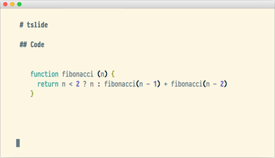
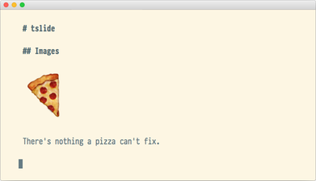

# tslide

> Terminal SlideDeck (for back end devs)

---

Controls: 
  * Left, Right: change slide.
  * Ctrl-C     : exit

---

# Usage

```
tslide README.markdown
```

each slide is a section of a markdown document.

"sections" are split at lines that start with `#`

---

## crude js syntax highlighting

```md
# tslide

## Code

‘‘‘js
function fibonacci (n) {
  return n < 2 ? n : fibonacci(n - 1) + fibonacci(n - 2)
}
‘‘‘

---
```



This feature is on by default. Disable via `--no-highlight`.

---

## images

[iTerm 2](https://www.iterm2.com) users can 
take advantage of [its inline image feature](https://www.iterm2.com/images.html) and use 
images in your slides.

```md
# tslide

## Images


There's nothing a pizza can't fix.

---
```



This feature is on by default. Disable via `--no-images`.

---

## emoji

Most terminals can print unicode emoji, and others can print system bitmap emoji
like macosx.

```md
# tslide

## Emoji

:sparkles:

Magic!

---
```

## Why?

Because I am the sort of guy who will write his own 
presentation software two hours before his talk.

---

## License

MIT

---

## Any Questions?

direct your queries to:

`/^(@|https://github.com/|http://)?dominictarr(.com)?$/`
